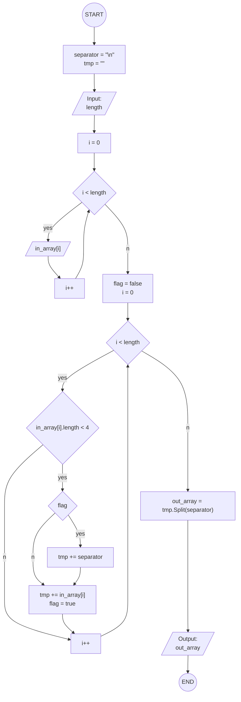

# Бок-схема решения задачи итоговой проверочной работы за I четверть

**Задача:** Написать программу, которая из имеющегося массива строк формирует массив из строк, длина которых меньше либо равна 3 символа. Первоначальный массив можно ввести с клавиатуры, либо задать на старте выполнения алгоритма. При решении не рекомендуется пользоваться коллекциями, лучше обойтись исключительно массивами.

**Примеры:**

	["hello", "2", "world", ":-)"] -> ["2", ":-)"]
	["1234", "1567", "-2", "computer science"] -> ["-2"]
	["Russia", "Denmark", "Kazan"] -> []

## Блок-схема

## Описание

Текстовое описание алгоритма доступно по [ссылке](README.md).

## Исходный код C#

Исходный код доступен по [ссылке](task/Program.cs).